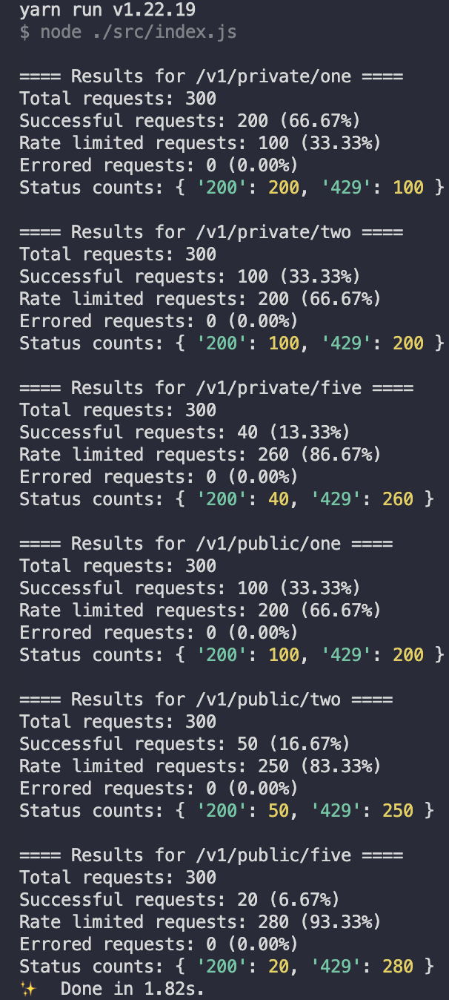

<!-- PROJECT LOGO -->
<br />
<p align="center">
  <a href="https://github.com/MoonTory/rate-limited-api">
    
  </a>

  <h3 align="center">rate-limited-api</h3>

  <p align="center">
    Example  rate-limited application developed with NodeJS & Redis
    <br />
    <a href="https://github.com/MoonTory/rate-limited-api"><strong>Explore the docs »</strong></a>
    <br />
    <br />
    <a href="https://github.com/MoonTory/rate-limited-api/issues">Report Bug</a>
    ·
    <a href="https://github.com/MoonTory/rate-limited-api/issues">Request Feature</a>
  </p>
</p>

<!-- TABLE OF CONTENTS -->

# Table of Contents

- [Table of Contents](#table-of-contents)
	- [Description](#description)
	- [Motivation](#motivation)
	- [Summary of the App](#summary-of-the-app)
	- [Requirements](#requirements)
	- [Prerequisites](#prerequisites)
	- [How to Run the Demo](#how-to-run-the-demo)
	- [Built With](#built-with)
	- [Author(s)](#authors)
	- [License](#license)

## Description

'rate-limited-api' is a test project designed for a job interview to demonstrate an ability to implement a rate-limiting functionality in a Node.js server, without the use of any third-party rate-limiter libraries. The project is an Express.js server with custom middleware to rate limit concurrent user requests. The project repository is organized as a Yarn workspace and contains two packages, 'client' and 'core'. The 'client' package is a simple Node.js script that tests the API, while the 'core' package contains the server API, written in Typescript.

## Motivation

This project was created to show off an ability to adhere to strict requirements, and to demonstrate skills in planning and organizing a project. It is not just about the implementation of the rate-limiter, but also about project organization and the use of workspaces.

## Summary of the App

The application is divided into two main packages, 'core' and 'client'.

The 'core' package is the primary server, written in TypeScript, which includes a custom rate-limiter middleware. This middleware, leveraging Redis' MULTI/EXEC transaction functionality, ensures atomicity and concurrency between requests, effectively limiting the number of concurrent user requests to prevent server overloads.

The rate-limiting algorithm used in this middleware is a 'fixed window' rate limiting algorithm, which is simple and efficient for most use cases. However, for real-world applications where more flexibility might be needed for users, it could be replaced with a 'sliding window' algorithm to provide a smoother rate limiting experience.

If needed, this solution could be further scaled by replicating the number of Docker containers running or using Node.js `cluster` mode to add more concurrency to the server. Since we are using Redis transactions, atomicity would be maintained across all containers, providing a robust and scalable solution for handling high load scenarios.

The 'client' package is a simple Node.js script that sends requests to the server, serving to test the rate-limiting functionality.

All components of the application are containerized using Docker, allowing for quick and easy setup for development purposes using Docker Compose. This project structure ensures a high degree of scalability and ease of deployment, making it suitable for real-world applications beyond its original scope as a demonstration and test project.

## Requirements

The following requirements were addressed in the development of this project:

1. Implement a basic auth middleware. It could be just an uuid token passed in headers, or it could be a jwt. No need to implement login/register routes. You can just store the token somewhere (env, app, db).
2. Implement 2 types of routes: public and private. Private routes should use the auth middleware.
3. Implement a rate limiter. It should check a token limit for private routes and a ip limit for public routes.
4. The rate limit is set to 200 requests per hour per token
5. The rate limit is set to 100 requests per hour per IP
6. The token limit and IP limit values can be configured from the environment.
7. When a user reaches the limit, an error message is shown indicating the current limit for that user account and when (time) the user can make the next request.
8. Concurrency is kept in mind. The solution can handle multiple requests at the same time.
9. Performance was taken into consideration.
10. (Bonus) An optional task to create a different weight of request rate for every URL was also included: 1/2/5 points per request (assuming 5 different end points) depending on the end point.

## Prerequisites

- Node.js v18.13.0 or above. Use Node Version Manager to switch to the correct version with `nvm use 18.13.0`, or ensure your system has the latest version of Node.js installed.
- Docker installed on your machine.
- Docker Compose installed on your machine.

## How to Run the Demo

1. Clone this repository from GitHub.
2. Ensure you have the required tools installed as described above (Node.js & Docker).
3. Install Yarn globally if it's not already installed, using `npm install -g yarn`.
4. In the root directory of the project, run `yarn` to install all dependencies.
5. Run `yarn dev` to execute the `docker-compose -f docker-compose.dev.yml up` command. This builds the Docker images and runs the server and Redis containers.
6. Open another terminal window. Navigate into the client package directory with `cd packages/client`.
7. Run `yarn start` to start the client test script.
8. The output of the script should look something like the following

<p align="center">

</p>

After reaching the rate limit the server responds with the following `429` error.

```json
{
	"retryAfter": 2864,
	"message": "Rate limit exceeded",
	"nextValidRequestTime": "2023-08-07T13:58:21.835Z"
}
```

Where `retryAfter` are seconds left until the user can retry to make a request & `nextValidRequestTime` is in a date format informing the user the exact time when they can make another request.

## Built With

- [Typescript](https://www.typescriptlang.org/)
- [NodeJs](https://nodejs.org/en/)
- [Redis](https://redis.io/)
- [Docker](https://www.docker.com)

## Author(s)

- **Gustavo Quinta** - _Initial work_ - [MoonTory](https://github.com/moontory)

## License

This project is licensed under the MIT License - see the [LICENSE](LICENSE) file for
details
